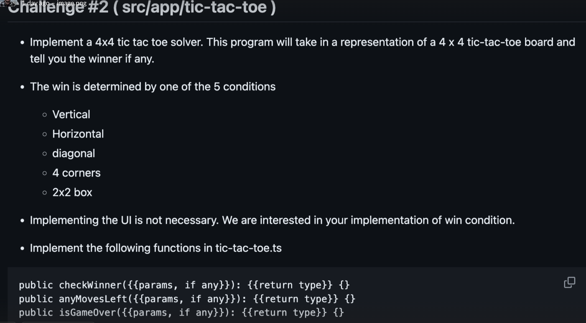
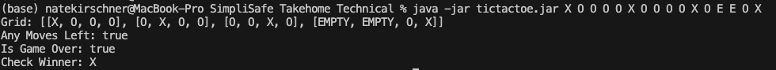
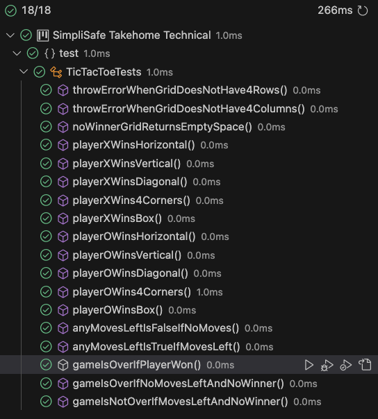

# SimpliSafe Technical Assessment - TicTacToe Solver

##### By Nathan Kirschner

## Instructions

## Implementation

I implemented the class TicTacToe in src/TicTacToe.java.
It defines the public enum GridSpace which is either an X, O, or EMPTY representing how a grid space in the tic tac toe board can be filled.
The constructor takes a 2d ArrayList of GridSpace which it stores in a private field variable as the grid.

## Methods

The public methods of the class are the following:

- `anyMovesLeft()`

  - Determines if there are still moves left to be made.
  - I made the decision that this would simply return if there are still empty spaces in the grid regardless if someone has won, so that the results are different than the `isGameOver()` method.

- `isGameOver()`

  - Determines if either a player has won the game or if no more moves can be made.

- `checkWinner()`
  - Checks which player has won the game. If no one has won, returns GridSpace.EMPTY. I chose this value to indicate a draw for simplicity rather than creating a new type.

My implementation of the `checkWinner()` method involves checking each type of win condition one by one, for each player. While it would be computationally faster to check each player during the same iteration of the grid, or check multiple win conditions during the same iterations, I chose to keep them separate for the purposes of extensibility. If the win conditions change in the future, or the player types change, it is easy to sub in different win condition private methods rather than have them all be coupled to each other.

## How To Run

The program can be run using the jar file `tictactoe.jar`. Run using the command `java -jar tictactoe.jar` and follow with a sequence of X, O, and E characters representing the board in order from left to right and top to bottom. See the screenshot below for an example. Make sure you have the java jdk installed.

## Testing

My tests for the TicTacToe class are in the `/test/TicTacToeTests.java` file.

